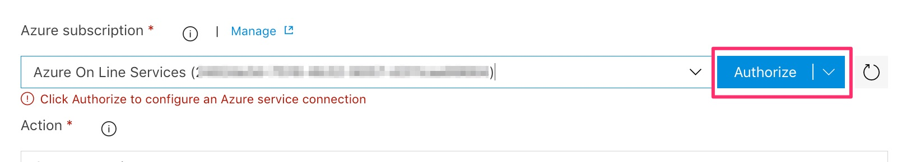

# Creating a basic pipeline

This describes a simple approach to provisioning Azure resources within an Azure DevOps release pipeline. As an example this uses the Azure Security and Compliance Blueprint [Azure Three-Tier IaaS Web Application for UK OFFICIAL architecture](https://docs.microsoft.com/en-us/azure/security/blueprints/ukofficial-iaaswa-overview).

The documentation above shows how to provision the resources using either PowerShell or via the Portal, here we will step through creating a repeatable deployment pipeline that can include multiple environments as well as approvals and other capabilities.

## Prerequisites:

1. A [GitHub account](https://github.com/).
2. An Azure subscription, [create a free subscription if needed](https://azure.microsoft.com/en-us/free/)
3. An Azure DevOps organisation. If you don't have one create a free [Azure DevOps organisation](http://dev.azure.com). [Guidance for creating an organisation](https://docs.microsoft.com/en-us/azure/devops/user-guide/sign-up-invite-teammates?view=vsts)
4. To [setup a private Azure DevOps agent e.g. in an Azure VM](https://docs.microsoft.com/en-us/azure/devops/pipelines/agents/v2-windows?view=vsts). The resources created in this take longer to provision than the 30 min maximum for the hosted agents. 

## Step 1: Fork the Github repo

The ARM templates we'll use are in [this GitHub repo](https://github.com/Azure/uk-official-three-tier-webapp). Fork this repo to your own repo in Github in order to reference it from Azure DevOps and also to maintain your own version of the assets. 

1. [Browse to the Azure GitHub repo](https://github.com/Azure/uk-official-three-tier-webapp)
2. Click Fork:

3. You now have a repo in your account forked from Azure/uk-official-three-tier-webapp. Select the clone/download button and copy the URL for use in the next step:

## Step 2: Create an Azure DevOps Team Project

1. Open a browser and navigate to your Azure DevOps organisation. The old URL is  https://youraccountname.visualstudio.com and will work indefinitely or the new URL is https://dev.azure.com/yourorganisationname.
2. In your Azure DevOps organisation select Create Project. Give the project a name. Make sure that version control is set to Git (select Advanced to show the options) and click Create. You could equally choose to use TFVC but the assumption here is that Git is being used.

4. Your Azure DevOps team project has been created. [Optionally add other people to the team.](https://docs.microsoft.com/en-us/azure/devops/organizations/security/add-users-team-project?view=vsts&tabs=new-nav)

## Step 3: Import the artifacts into the Team Project

You could either leave the ARM templates in Github or you can import them into Azure DevOps. In this example we'll import them into Azure DevOps so that you have a self-contained project.

1. In your newly created Azure DevOps project select the Repos button:

2. Select import:

3. Paste in the Github clone URL from Step 1 and select Import:

4. Wait a short time (a minute or less):

5. The ARM templates are now in your Azure DevOps project repo.

## Step 4: Create a new release pipeline

For now this is a pure infrastructure deployment, without an application, and therefore there is no need for continuous integration (ARM templates don't compile). Therefore create a release pipeline.

1. Navigate to Releases (Pipelines | Releases):

2. Select New pipeline:

3. Select Empty Job (i.e. don't use a template):

4. Name the default stage and click the close button. This will be the first environment that you create and provision, so you might want to call this sandbox, dev, test or something similar. Later we'll add another (e.g. production) environment:

5. Rename the release pipeline to something more meaningful to you e.g. UKIaaSWeb.Pipeline

6. Save the pipeline, accept the default folder and click OK:

You now have a blank pipeline ready to start configuring.

## Step 5: Add the artifact source and trigger

The pipeline needs to know where to look for the artifacts to use and deploy.

1. In the Artifacts area click Add:

2. Select the source of the artifacts as Azure Repos (this is where if you chose GitHub you could link directly there or to alternate sources). Chose the project you created earlier and set the repo to the one you imported into to, then click Add:

3. Now set the trigger so that this release pipeline will run when any commits are made to the git repo, in other words to enable continuous deployment on any change. Select the lightning bolt above the artifact:

4. Enable continuous deployment and click the close button:

5. Click Save, and optionally add a comment.

## Step 6: Add ARM provisioning tasks

When the release pipeline is triggered it will then execute a series of tasks. We will setup the tasks to run the ARM templates in the reference architecture. They are divided into 3 so we will have 3 tasks to replicate that.

1. Click on the first stage link "1 job, 0 tasks":

2. Change the Agent Job agent pool to the self hosted (private) agent you created in step 4 of the prerequsitites at the top.

### Step 6.1 Provision the network
1. Click the plus button on the Agent Job, search for group and select the Azure Resource Group Deployment task. Click Add:

2. Click the new task on the left hand side and then select the subscription that you want to use:

3. Authorise the subscription (one off activity per Team Project):

4. Provide a resource group. We'll create a new resource group and use a variable (for reuse within and across the stages). Add a variable name in the form $(variablename), e.g. $(IaaSWebRG)

5. Set the location to the region of your choice.
6. In the Template setting, select the ellipsis button and navigate to and select the virtualnetwork.azuredeploy.json file. This is located via the linked artifacts that you configured earlier:

7. In this example there are no template parameters that need to be set so that's all that needs to be set for this task. You might want to rename the task and then save your changes:

### Step 6.2 Create the resource group variable

1. Select the Variables tab, add a new variable, give it the same name as you used in the previous step, give it a value and set the scope to the stage (e.g. Test), then save:

### Step 6.3 Provision AD

1. Select the Tasks tab and the stage that you were working on to return to the tasks. As in the steps above add another Azure Resource Group Deployment task to run after the provision network task.
2. Set the following properties:
 - Choose the same subscription as above (already authorised).
 - Set the same resource group (use the same variable).
 - Set the same region.
 - For the template select aads.azuredeploy.json
 - Rename the task.
 
3. Optionally overide some of the default parameters to the ARM template. To do this select the button in the ellipsis button in the Override template parameters setting:

4. Change the values as appropriate. For example change the vmAdminPassword to a new variable:

5. Click OK and save.

6. If you added a variable in the parameters then create a new variable with that name and add a value as in Step 6.2 above. Note that you can also lock a variable so that the value is encrypted.

7. Click save.

### Step 6.4 Provision workloads

1. As in the steps above add another Azure Resource Group Deployment task to run after the provision AD task.
2. Set the following properties:
 - Choose the same subscription as above (already authorised).
 - Set the same resource group (use the same variable).
 - Set the same region.
 - For the template select workloads.azuredeploy.json
 - Optionally overide the parameters as above and reuse the variables, if used.
 - Rename the task.
 
 3. Click save.

## Step 7: Add an additional stage

To simulate continuous deployment across multiple environments add a new stage to represent production.

1. Click the Pipeline tab to return to the Pipeline view.
2. Move the mouse under the existing stage and select Clone:

3. Select the new stage and rename it e.g. to Production and click the close button:

4. As a variable was used for the resource group go in Variables and change the resource group value for the Production stage. I've used IaaSWebTest-RG and IaaSWebProd-RG respectively. Save when updated:

## Step 8: Add an approval

We may want the infrastructure deployment into production to require an approval.

1. In the Pipeline view select the Production stage pre-deployment, enable Pre-deployment approvals and add either the Team Project group and/or yourself as an example of giving either a group and/or an individual approval. Click the close button when done:

2. Save the pipeline.

Now the approvers will be notified (via email by default but into other tools as required such as Teams or Slack) and the deployment into production will not take place until approval has been given. 

## Step 9: Create a release

Now to try it out. You could either update and commit something in the git repo to trigger the release or create a manual release. Here we'll create a manual release.

1. In the Pipeline view select Release | Create a release:

2. Keep all the defaults and click Create:

3. Click on the link in the banner telling you that a release has been created:

4. You can watch the progress of the deployment:

Note that these templates take approximately 1 hour 20 minutes to provision the resources. You can wait for the default email notification for success or failure, if successful in the first stage the deployment will then wait for approval prior to starting the deployment into production.

## Next Steps

1. Add ARM template validation and policy tasks.
2. Deploy an application into the workload.
3. Improve variable security with Azure Key Vault integration.